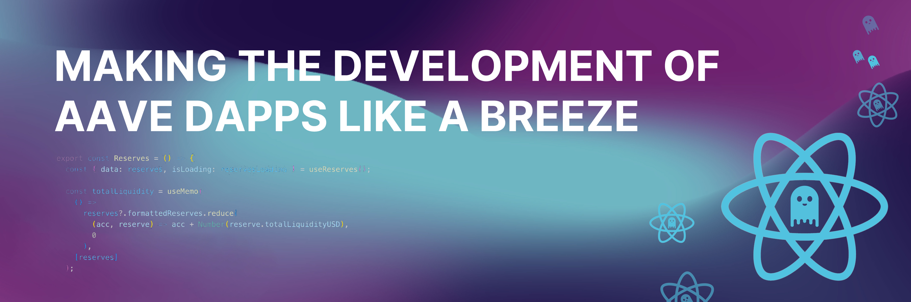

# Aave V3 React




## Overview

`aave-v3-react` is a React SDK that makes creating a dApp on top of the Aave Protocol V3 feeling like a breeze. We offer a full suite of hooks and providers integrated with `wagmi` and `viem` to make devs life easier.

## Features

- (Almost) full integration with the Aave Protocol V3
  - Check the opened issues for the missing methods. 100% integration coming soon;
- Wagmi integration
- Simple hooks for reading and writing from/to the Aave V3 pools
- Comprehensive TypeScript support
- Next.js and Vite example apps

## Installation

You can install the package using your favourite package manager like:

```bash
npm install aave-v3-react @tanstack/react-query wagmi viem@2.x connectkit @tanstack/react-query-devtools
```

or

```
yarn add aave-v3-react @tanstack/react-query wagmi viem@2.x connectkit @tanstack/react-query-devtools
```

### Note on the additional packages

aave-v3-react depends on `@tanstack/react-query`, `wagmi` and `viem`. If any of those packages is missing or installed with an unsupported version, it's possible you experience errors like:

- `useQuery must be used with QueryClientProvider`;
- `useChain must be used with Wagmiprovider`;

If this is the case, please double check the version of the packages before opening an issue.

## Quick start

if you have installed all the packages above, you can spin up your project quickly with the following structure:

```
my-project/
│
├── src/
│ ├── App.tsx
| |── wagmiConfig.ts
│ └── main.tsx
│
└── package.json
```

`wagmiConfig.ts`

```
import { supportedNetworks } from "aave-v3-react";
import { getDefaultConfig } from "connectkit";
import { createConfig, http } from "wagmi";
import { Chain } from "wagmi/chains";

/**
 * his config allows wagmi to support all the networks supported by aave-v3-react, feel free to
 * change it according to your needs
 */
export const config = createConfig(
  getDefaultConfig({
    appName: "Vite/AAVE react sdk sample app",
    walletConnectProjectId: "PROJECT_ID",
    // TODO: IS there a better type for this?
    chains: supportedNetworks as unknown as readonly [Chain, ...Chain[]],
    transports: supportedNetworks.reduce(
      (acc, network) => {
        acc[network.id] = http();
        return acc;
      },
      {} as Record<number, ReturnType<typeof http>>,
    ),
  }),
);
```

`main.tsx`

```
import React from "react";
import ReactDOM from "react-dom/client";
import { ChakraProvider } from "@chakra-ui/react";
import { WagmiProvider } from "wagmi";
import { QueryClient, QueryClientProvider } from "@tanstack/react-query";
import { ReactQueryDevtools } from "@tanstack/react-query-devtools";
import { ConnectKitProvider } from "connectkit";
import { config } from "./config";
import { App } from "./App";

/**
* To be configured based on your needs. All the aave-v3-react hooks will store data here
*/
const queryClient = new QueryClient();

ReactDOM.createRoot(document.getElementById("root")!).render(
  <React.StrictMode>
    <ChakraProvider>
      <WagmiProvider config={config}>
        <QueryClientProvider client={queryClient}>
          <ReactQueryDevtools initialIsOpen={false} />
          <ConnectKitProvider>
            <AaveContractsProvider>
              <App />
            </AaveContractsProvider>
          </ConnectKitProvider>
        </QueryClientProvider>
      </WagmiProvider>
    </ChakraProvider>
  </React.StrictMode>
);
```

`App.tsx`

```
import { formatBalance, useReserves  } from "aave-v3-react";
export const App = () => {

    const { data, isLoading, error } = useReserves()

    console.log({data, isLoading, error})


    return (
        <div>
            <h1> Total liquidity </h1>
            <b>{formatBalance(
                    userReserves?.formattedReserves.totalLiquidityUSD,
                    "USD",
                )}
            </b>
        </div>
    )
}
```

### About Next.js

`aave-v3-react` is fully complatible with next.js, but you may experience some issues with `wagmi` and `connectkit` in some cases. Make sure to add the `"use client";` directive where needed, and eventually check their docs to tackle such errors.

### React native

React native support is still unexplored but should work out of the box. In case you managed to integrate the library there correctly, please open a PR documenting that and possibly providing an example app.

## API Reference

Full API reference is coming soon.
For the moment you can refer to [aave-utilities](https://github.com/aave/aave-utilities). Most of the V3 methods available there have been integrated, and we aim to full support.

Also, a few methods like

- `useReserves`
- `useUserReserves`
- `useSupply`
- `useWithdraw`

  have been fully integrated in the [example apps](https://github.com/akanoce/react-aave-sdk/tree/main/apps).

## Future of the project

`aave-v3-react` is a reactive wrapper on top of [aave-utilities](https://github.com/aave/aave-utilities), in the short/mid term we aim to:

- Implement all the V3 methods available there
- Fix some type errors and liting issues
- Keep the library up-to-date with the latest releases
- 100% coverage with unit/e2e
- Investigate react-native support
- Add more examples

## Contributing

Contributing guidlines are coming soon.
If you want to contribute to this project, open an issue, PR or write me on X ([@ErikNucibella](https://x.com/ErikNucibella))

## Acknowledgments

- [Aave Protocol](https://aave.com/)
- [Aave Grants](https://aavegrants.org/)
- [React](https://reactjs.org/)
- [TypeScript](https://www.typescriptlang.org/)
